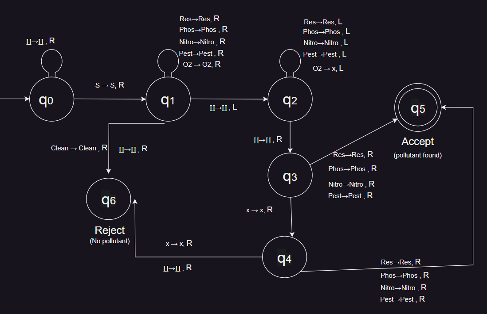
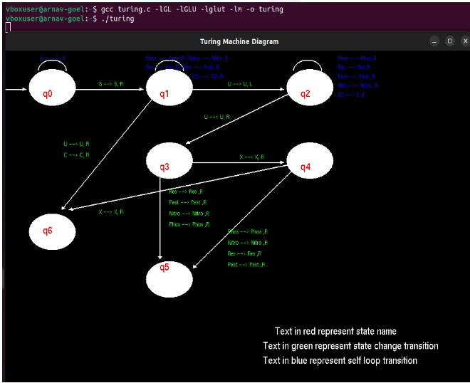

# Turing-machine 

 Intensive Agriculture Runoff: Runoff from intensive agriculture carries pollutants into water bodies, causing water quality issues and ecosystem disruption.

 ### In this project I have generated an algorithm to check water quality of water bodies.The turing machine is being generated by open GL in linux environment.

 ## Turing machine
 
 ## Output of Open Gl code
 
